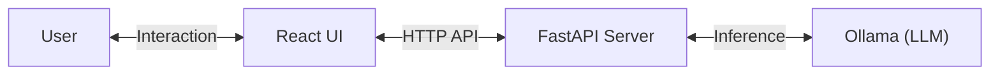

# Local ChatGPT Clone

A full-stack, locally running AI chat application that functions completely offline. Built to demonstrate how to integrate Local LLMs into modern web applications.


## 🏗️ Architecture

Unlike running a model directly in the terminal with `ollama run`, this project implements a full **Client-Server Architecture**. This mimics how real-world AI applications (like the real ChatGPT) are built.



### Key Learnings & Differences
| Feature | CLI (`ollama run`) | This Project (Full Stack) |
|---------|-------------------|--------------------------|
| **Interface** | Terminal / Command Line | Modern Web UI (React + Tailwind) |
| **Integration** | Direct user-to-process binding | **API Pattern**: Frontend talks to Backend API |
| **Extensibility** | Limited | High (Can add auth, database, RAG, etc.) |
| **Control** | Standard Output | Custom parsing, streaming, and formatting |

## 🛠️ Tech Stack

- **Large Language Model**: [Ollama](https://ollama.com/) (running `llama3.2:1b`)
- **Backend**: Python, FastAPI
- **Frontend**: React, Vite, TailwindCSS

## 🚀 Getting Started

### Prerequisites
- [Ollama](https://ollama.com/) installed and running.
- Model pulled: `ollama pull llama3.2:1b`
- Node.js & Python installed.

### Run Locally
The project includes a helper script to start both servers at once:

```bash
./start.sh
```

Open your browser to [http://localhost:3000](http://localhost:3000).

## 📂 Project Structure

- `/backend`: FastAPI application handling chat requests.
- `/frontend`: React application for the chat interface.
